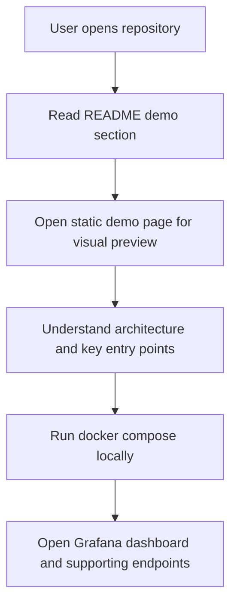

## 1. Product Overview
- 为 `ecommerce-sre-lab` 增加一个本地可查看的静态 demo 展示页，并补齐 README 演示说明，帮助用户在不做公网部署的前提下快速判断系统效果。
- 目标用户是仓库访客、面试官和项目维护者；价值在于让项目具备清晰入口、可视化预览和本地验证路径。

## 2. Core Features

### 2.2 Feature Module
1. **Static demo page**: 项目概览、架构说明、核心入口、运行步骤、演示场景、关键面板预览。
2. **README demo section**: 在中英文 README 中补充 demo 入口、预览说明、建议截图位与本地查看指引。

### 2.3 Page Details
| Page Name | Module Name | Feature description |
|-----------|-------------|---------------------|
| Static demo page | Hero overview | 展示项目定位、核心能力、启动方式和主入口链接 |
| Static demo page | Architecture panel | 用静态可视化方式说明 exporter、Prometheus、Grafana、runbooks 的关系 |
| Static demo page | Preview cards | 以静态 mock 卡片方式展示 dashboard、metrics、state、chaos drill 等关键界面 |
| Static demo page | Demo walkthrough | 提供按步骤浏览本地系统的操作说明与建议顺序 |
| README (EN/CN) | Demo section | 说明本地 demo 入口、静态演示页用途、实际运行地址与截图建议 |

## 3. Core Process
用户进入仓库后，先从 README 看到本地运行入口和静态 demo 页入口；如果暂时没有启动 Docker，也可以先通过静态 demo 页理解系统结构、页面布局和演示重点。启动本地环境后，再按 README 的顺序访问 Grafana、Prometheus、metrics、state 等真实入口。

## 4. User Interface Design
### 4.1 Design Style
- Primary and secondary colors: 深色监控风格，中性色背景配青蓝与黄绿高亮
- Button style: 圆角较小、控制台式按钮和标签
- Font and sizes: 标题使用有辨识度的技术展示字体，正文使用易读无衬线字体
- Layout style: Desktop-first，监控控制台式分区布局，包含 hero、status rail、preview grid
- Icon/emoji style suggestions: 使用简洁工程化图标，不使用娱乐化 emoji

### 4.2 Page Design Overview
| Page Name | Module Name | UI Elements |
|-----------|-------------|-------------|
| Static demo page | Hero overview | 项目名、定位、CTA、状态标签、深色渐变背景 |
| Static demo page | Architecture panel | 流程线、组件关系、说明文案、轻量动效 |
| Static demo page | Preview cards | Grafana、Prometheus、metrics、state 的静态 mock 面板 |
| Static demo page | Demo walkthrough | 分步骤指引、终端命令块、访问 URL 列表 |
| README (EN/CN) | Demo section | 链接、说明表、运行提示、截图建议 |

### 4.3 Responsiveness
- 采用 desktop-first 设计
- 在平板与手机尺寸下改为单列布局
- 保持关键入口卡片和命令块可滚动与可复制
