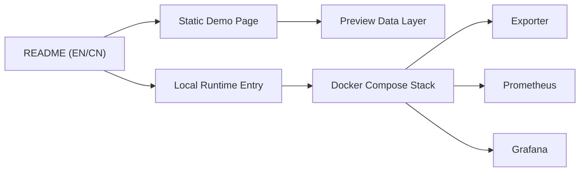
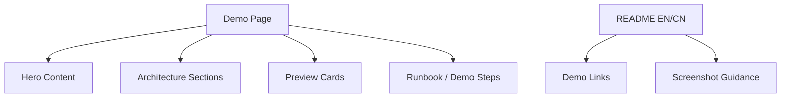

## 1. Architecture Design


## 2. Technology Description
- Frontend: None, 采用仓库内静态 HTML/CSS/JS 演示页
- Initialization Tool: None
- Backend: None
- Database: None，使用静态内容与现有项目信息

## 3. Route Definitions
| Route | Purpose |
|-------|---------|
| `/README.md` | 英文入口与 demo 说明 |
| `/README.zh-CN.md` | 中文入口与 demo 说明 |
| `/demo/` or `/docs/` | 静态 demo 展示页，用于本地或 GitHub Pages 预览 |

## 4. API Definitions (if backend exists)
无后端 API 新增。本次只引用现有系统运行地址作为展示信息：

```ts
type DemoEndpoints = {
  dashboard: "http://localhost:3000/d/ecommerce-overview";
  grafanaAdmin: "http://localhost:3000";
  prometheus: "http://localhost:9090";
  metrics: "http://localhost:8000/metrics";
  state: "http://localhost:8000/state";
};
```

## 5. Server Architecture Diagram (if backend exists)
无新增服务端架构。本次实现仅新增静态展示层与 README 说明层。

## 6. Data Model (if applicable)
### 6.1 Data Model Definition


### 6.2 Data Definition Language
不涉及数据库或 DDL。

## 7. Implementation Notes
- 静态 demo 页放在适合直接预览的目录中，优先考虑 `docs/`，便于未来如需 GitHub Pages 时直接复用
- 页面内容必须与当前项目现状一致，不能伪造不存在的功能
- 演示页中的预览卡片使用静态 mock 表达真实布局，不宣称为实时数据截图
- README 需同时补充：
  - 静态 demo 页入口
  - 本地运行命令
  - 实际可访问地址
  - “静态预览 vs 本地真实系统” 的区别说明
- 本次不新增构建链，不引入外部服务，优先使用原生 HTML/CSS/JS
